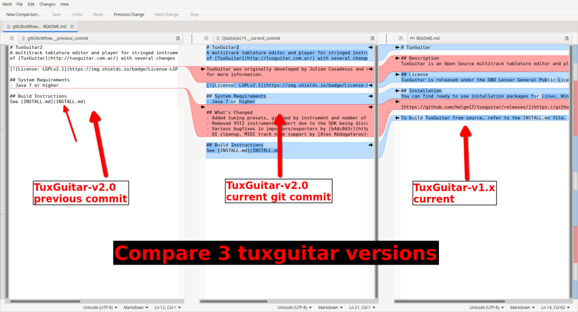

# What is this?
This is for helping backport features from TuxGuitar2.0-beta to TuxGuitar 1.x.

It's just a little collection of scripts and files to make the TuxGuitar2.0-beta compile on linux easier.

It's for compiling previous git commits, so we can work on backporting features from 2.0 to the 1.x fork.

# How to use
Put this folder into the tuxguitar root folder.

Run the ./download-swt.sh script, because tuxguitar requires a few different versions of swt.

Run the ./build-tuxguitar.sh script to attempt to compile.

e.g.
```
git clone https://github.com/helge17/tuxguitar-2.0beta.git
cd tuxguitar-2.0beta.git
git clone https://github.com/sslater11/tuxguitar-simons-build-scripts.git
cd tuxguitar-simons-build-scripts
./download-swt.sh
./build-tuxguitar.sh
```
If you get a compilation error, check below under "Compilation errors" for a potential solution.


# Finding features for backporting.
The Tuxguitar project split at this git commit at Sun Mar 24 15:21:59 2019.

Git commit hash: fb3c0035f4faccd83097e46a990bb589d2a1e7a5

We can use "git bisect" to find the git commits for each feature. If you don't know of git bisect, watch a youtube video on it, it's very easy and useful.

We can tell git bisect to look no further back than fb3c0035f4faccd83097e46a990bb589d2a1e7a5 by using this command
```
git checkout master
git bisect new HEAD # Tell git the newest version is the current codebase
git bisect old fb3c0035f4faccd83097e46a990bb589d2a1e7a5 # tell git to not look any further than when the projects split
```
Now we can compile each version and test

Compile with
```
./build-tuxguitar.sh
```
If the feature is present, we run
```
git bisect new
```
If the feature isn't present, we run
```
git bisect old
```
Repeat building and running either "git bisect old" or "git bisect new", and we will end up on the commit that introduced the feature.

## Meld merge script
Used to compare 3 versions of the TuxGuitar code.
TuxGuitar-v2.0's previous git commit.
TuxGuitar-v2.0's current git commit.
Tuxguitar-v1.x's similar file.

Install meld
```
sudo apt install meld
```
Whilst backporting changes, we can now jump to any git commit in TuxGuitar-v2.0,"
look at the changes in a file for the commit we're on, and"
compare this to the file in the TuxGuitar-v1.x folder."

### How to use:
Only changes to the TuxGuitar-v1.x file will be saved.
```
cd tuxguitar-2.0beta
# Compare different versions of the README.md file.
./tuxguitar-simons-build-scripts/meld_merge.sh README.md
```
### Example:
Try this example where the README.md file was updated.
We can see the change that was made to this version of README.md,
and compare it to the README.md in TuxGuitar-v1.x
```
cd tuxguitar-2.0beta
git checkout 52f94768a51946a43357a29a9bee1b08264b967f
./tuxguitar-simons-build-scripts/meld_merge.sh README.md
```
[](pics/meld_merge_screenshot_small.png)

# Compilation errors
## Source option 5 is no longer supported
If you got this error above: \[ERROR\] error: Source option 5 is no longer supported. Use 7 or later.

This is because we need to use JDK 1.7 and need to reflect this in the pom.xml file.

To solve it, copy the POM files from this build script's directory. Look for the pom files in the folder dated just after the date of the git commit you're trying to compile.

i.e. you could overwrite the files tuxguitar-2.0beta/pom.xml and tuxguitar-2.0beta/TuxGuitar-lib/pom.xml with the ones in the folder 2023_03_16/

You may need to run this command if copying the files didn't work.
```git difftool filename```
In all pom files, remove all new additions, and remove the changed line with SNAPSHOT on it. It should compile when the diff shows only changes to lines and no new additional lines.

## SWT jar file missing
If you haven't downloaded and installed the SWT versions you will get an error like this:

```
[ERROR] Failed to execute goal on project tuxguitar-ui-toolkit-swt: Could not resolve dependencies for project org.herac.tuxguitar:tuxguitar-ui-toolkit-swt:jar:2.0-SNAPSHOT: Could not find artifact org.eclipse.swt:org.eclipse.swt.gtk.linux.x86_64:jar:4.11 in swt-repo (https://cyclopsian.github.io/maven-eclipse/maven/) -> [Help 1]
or
[ERROR] Failed to execute goal on project tuxguitar-ui-toolkit-swt: Could not resolve dependencies for project org.herac.tuxguitar:tuxguitar-ui-toolkit-swt:jar:2.0-SNAPSHOT: Could not find artifact org.eclipse.swt:org.eclipse.swt.gtk.linux.x86_64:jar:4.13 in swt-repo (https://cyclopsian.github.io/maven-eclipse/maven/) -> [Help 1]
or
[ERROR] Failed to execute goal on project tuxguitar-ui-toolkit-swt: Could not resolve dependencies for project org.herac.tuxguitar:tuxguitar-ui-toolkit-swt:jar:2.0-SNAPSHOT: Failure to find org.eclipse.swt:org.eclipse.swt.gtk.linux.x86_64:jar:4.13 in https://cyclopsian.github.io/maven-eclipse/maven/ was cached in the local repository, resolution will not be reattempted until the update interval of swt-repo has elapsed or updates are forced -> [Help 1]
or
[ERROR] Failed to execute goal on project tuxguitar-ui-toolkit-swt: Could not resolve dependencies for project org.herac.tuxguitar:tuxguitar-ui-toolkit-swt:jar:2.0-SNAPSHOT: Could not find artifact org.eclipse.swt:org.eclipse.swt.gtk.linux.x86_64:jar:4.12.0-SNAPSHOT in swt-repo (https://cyclopsian.github.io/maven-eclipse/maven/) -> [Help 1]
```

To fix this, we can download the correct SWT version. running the download script will get the SWT versions.
Running the build script, there's lines to install the SWT versions to maven.
If it's asking for a version that's not 4.11, 4.12, or 4.13, then you will need to google "eclipse swt version_num" and download the swt zip file on the page. Then look at the build-tuxguitar.sh script for how the version is installed to maven.

# License
GNU LGPL v2.1
The pom.xml files were taken from the TuxGuitar2.0-beta project, which is also under GNU LGPL, so those files are under their copyright.

# Credits
The pom.xml files are copied from the TuxGuitar2.0-beta project, so all thanks go to those who contributed to it.

